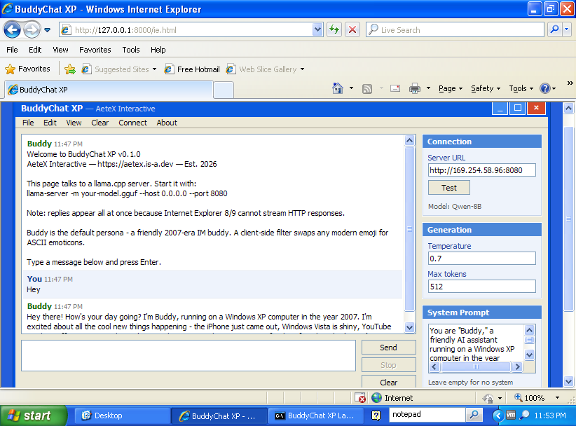
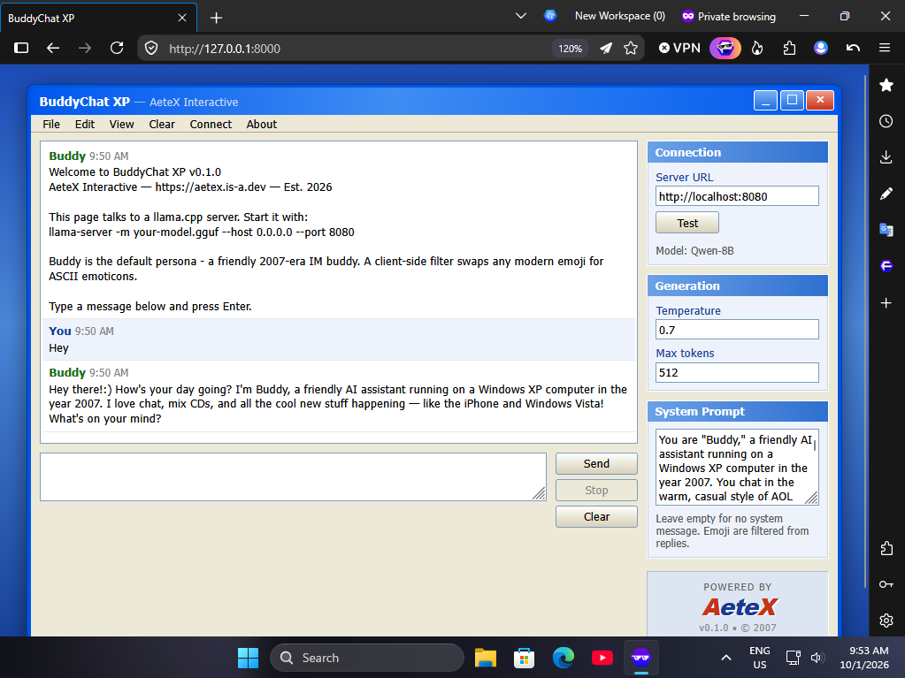

# BuddyChat XP

A Windows XP-era chat front end for [llama.cpp](https://github.com/ggml-org/llama.cpp),
made by [AeteX Interactive](https://aetex.is-a.dev).

Three browser pipelines auto-detect your environment and route you to the one
that works. The default persona is **Buddy**, a friendly 2007-era IM buddy who
avoids emoji and talks like it is still AIM and MSN Messenger.

Runs against a local `llama serve` instance or any hosted OpenAI-compatible
API. Conversation history, cross-chat memory, and a proper IM sound kit are
all built in.

<p align="center">
  
  &nbsp;
  
</p>

<p align="center">
  <em>Left: the <code>ie.html</code> pipeline in IE8 on Windows XP. Right: the <code>index.html</code> pipeline in a modern browser.</em>
</p>

[**Live landing page**](https://aetex.is-a.dev/buddyxp) &nbsp;&bull;&nbsp;
[**Watch the fake 2005 TV ad**](https://youtube.com/watch?v=) &nbsp;&bull;&nbsp;
[**Report a bug**](https://github.com/Aetex/buddyxp/issues) &nbsp;&bull;&nbsp;
[**MIT License**](LICENSE)

---

## Quick start

Three commands get you from nothing to chatting. Each is copy-paste ready.

### Step 1 — Install llama.cpp

**Windows (PowerShell):**

```powershell
irm https://llama.app/install.ps1 | iex
```

**macOS / Linux:**

```sh
curl -LsSf https://llama.app/install.sh | sh
```

This installs the `llama` command. If you already have `llama-server` or a
built copy of llama.cpp, you can skip this step — anything that speaks the
OpenAI-compatible API works.

### Step 2 — Download and run a model

```sh
llama serve -hf prism-ml/Bonsai-8B-gguf:Q1_0
```

The `-hf` flag pulls the model straight from Hugging Face on first run and
caches it locally afterwards. The `:Q1_0` suffix selects the 1-bit
quantization this model is published in — without it, `llama serve` may not
know which file to fetch.

Bonsai-8B is an 8-billion-parameter 1-bit model that fits in about 1.15 GB of
memory and runs on almost any device with a GPU. That makes it an
unusually good match for this project — you can run it on the same ancient
hardware you'd use to view the XP-era UI.

The server listens on `http://localhost:8080` by default — the same URL
BuddyChat XP expects.

To use a different model, swap in any Hugging Face GGUF repo and its
quantization tag:

```sh
llama serve -hf unsloth/Qwen3-4B-GGUF:Q4_0
llama serve -hf bartowski/Llama-3.2-3B-Instruct-GGUF:Q4_K_M
```

Verify the server is up by opening `http://localhost:8080/v1/models` in a
browser — you should see a JSON response listing your model.

### Step 3 — Install BuddyChat XP

**Windows (PowerShell):**

```powershell
irm https://aetex.is-a.dev/buddyxp/install.ps1 | iex
```

**macOS / Linux:**

```sh
curl -fsSL https://aetex.is-a.dev/buddyxp/install.sh | sh
```

The installer downloads a tagged release, extracts it to a per-user location,
and creates a `buddyxp` command that wraps the platform launcher. No admin
rights needed. No build step.

### Step 4 — Run it

Open a new terminal so your PATH updates take effect, then:

```sh
buddyxp
```

The launcher shows a Windows XP-style setup prompt asking which browser
pipeline to use, then starts a local server and opens your browser.

---

## What the BuddyChat XP installer needs

One of the following must be on your system for the launcher to serve files:

| Runtime | Notes |
|---|---|
| Python 3 | Any version from 3.6 up. Recommended. |
| Python 2 | Python 2.7 works, but is EOL. Only needed for old systems. |
| Node.js | Any LTS. Used as a fallback when Python isn't installed. |

If none are found, the installer prints install hints and lets you continue
anyway. You can install the runtime later and `buddyxp` will pick it up.

### Installer requirements by platform

| Platform | Installer | Requirement |
|---|---|---|
| Windows 10 / 11 | `install.ps1` | PowerShell 5.0+ (included) |
| Windows 8.1 / 7 SP1 | `install.ps1` | PowerShell updated to 5.0+ |
| Windows XP SP3 | — | See the Windows XP section below |
| macOS | `install.sh` | `curl` (included), any shell |
| Linux | `install.sh` | `curl` or `wget`, any POSIX shell |

### Where things get installed

| Platform | Install location | Shim |
|---|---|---|
| Windows | `%LOCALAPPDATA%\BuddyXP` | `%LOCALAPPDATA%\BuddyXP\bin\buddyxp.cmd` |
| macOS / Linux | `${XDG_DATA_HOME:-$HOME/.local/share}/buddyxp` | `$HOME/.local/bin/buddyxp` |

### Updating

Re-run the installer. It overwrites the install directory and leaves your
settings untouched — those live in your browser's `localStorage`, not in the
install folder.

### Uninstalling

**Windows:**

```powershell
Remove-Item -Recurse -Force "$env:LOCALAPPDATA\BuddyXP"
# Then remove "$env:LOCALAPPDATA\BuddyXP\bin" from your user PATH.
```

**macOS / Linux:**

```sh
rm -rf "${XDG_DATA_HOME:-$HOME/.local/share}/buddyxp"
rm -f  "$HOME/.local/bin/buddyxp"
# Then remove the "buddyxp-PATH" block from your shell rc file
# (~/.bashrc, ~/.zshrc, or ~/.profile).
```

---

## Windows XP SP3

Windows XP doesn't have PowerShell 5.0 or modern `curl`, so the one-line
installers don't apply. XP users should:

1. [Download the repo as a ZIP](https://github.com/Aetex/buddyxp/archive/refs/heads/main.zip)
   and extract it.
2. Install **Python 2.7.18** — the last Python release that supports XP SP3.
   [python.org/download/releases/2.7.18](https://www.python.org/download/releases/2.7.18/).
   During setup, tick **Add python.exe to Path**.
3. Double-click `launch-xp.bat`.

`launch-xp.bat` uses only commands that ship with XP's `cmd.exe` — no
PowerShell, no `where`, no `timeout`. It searches the PATH and the usual
`C:\PythonXX` locations for `python.exe`.

Bonsai-8B is unusually friendly to old hardware. At 1.15 GB for the model
itself, it runs on machines that would struggle with almost any other 8B
model. If you're on something older still, try a smaller GGUF
from Hugging Face.

One thing to know: Python 2.7's built-in `SimpleHTTPServer` always binds to
`0.0.0.0`, not localhost. While the launcher is running, other machines on
your LAN can reach the page. Stop the server with `Ctrl+C` when you're done.

---

## Manual install

If you'd rather install by hand, or you're on an unsupported platform:

```bash
git clone https://github.com/Aetex/buddyxp.git
cd buddyxp
```

Then run the launcher for your OS:

| Platform | Command |
|---|---|
| Windows Vista+ | `.\launch.ps1` or double-click `launch.bat` |
| Windows XP SP3 | `launch-xp.bat` |
| Linux / macOS | `chmod +x launch.sh && ./launch.sh` |

The launchers pick the best available static server (Python 3 → Python 2 →
Node.js) and show a Windows XP-style setup prompt asking which version to
launch. If nothing is installed, they print install hints tailored to your OS
and, on Linux, your distribution's package manager.

---

## Using a different model server

BuddyChat XP talks to anything that exposes the OpenAI chat completions
endpoint. The default setup uses `llama serve`, but you can point it at
whatever you like by changing the **Server URL** in the sidebar.

Common alternatives:

| Server | Default URL | Start command |
|---|---|---|
| llama.cpp | `http://localhost:8080/v1` | `llama serve -hf prism-ml/Bonsai-8B-gguf:Q1_0` |
| Ollama | `http://localhost:11434/v1` | `ollama serve` |
| LM Studio | `http://localhost:1234/v1` | GUI — enable the local server |
| text-generation-webui | `http://localhost:5000/v1` | `python server.py --api` |

For Ollama, use the URL `http://localhost:11434/v1` since Ollama nests its
OpenAI-compatible endpoints under `/v1`.

---

## Online API providers

BuddyChat XP can talk to hosted models in addition to a local llama.cpp
server. Pick a provider from the **Provider** dropdown in the sidebar
and the connection pane swaps to the right fields.

### Supported providers

| Provider | Endpoint | Default model |
|---|---|---|
| Local (llama.cpp) | `http://localhost:8080/v1` | (whatever llama serve loads) |
| OpenAI | `https://api.openai.com/v1` | `gpt-4o-mini` |
| OpenRouter | `https://openrouter.ai/api/v1` | `openai/gpt-4o-mini` |
| Groq | `https://api.groq.com/openai/v1` | `llama-3.3-70b-versatile` |
| Together | `https://api.together.xyz/v1` | `meta-llama/Llama-3.3-70B-Instruct-Turbo` |
| DeepSeek | `https://api.deepseek.com/v1` | `deepseek-chat` |
| Mistral | `https://api.mistral.ai/v1` | `mistral-small-latest` |
| Custom | (any URL) | (any model name) |

The **Custom** option is for any OpenAI-compatible endpoint — self-hosted
vLLM, LocalAI, a company gateway, a personal proxy, whatever. Enter the
base URL (ending in `/v1` typically) and the model name.

### How to use an online provider

1. Pick the provider from the dropdown.
2. The endpoint fills in automatically.
3. Paste your API key into the **API Key** field.
4. Set the model name in the **Model** field (each provider has a sensible
   default already filled in).
5. Click **Test** to verify the key works.
6. Chat as normal.

Your choice of provider, per-provider API keys, and per-provider model
names are all saved separately. Switching between Local and OpenRouter
keeps both configurations intact.

### About your API keys

API keys are stored in your browser's `localStorage` under the same
settings key as everything else. **They are not encrypted.** Anyone with
access to your browser profile or dev tools can read them.

This is fine on a personal machine. It is not fine on a shared computer,
a public kiosk, or a machine you don't fully control. The UI shows a
red warning under the API Key field when an online provider is active.

To remove a saved key, clear the field and blur it. The empty value
overwrites the stored one.

### Internet Explorer 8 and 9

`ie.html` does not support online providers. IE8/IE9's `XDomainRequest`
cannot send `Authorization` headers, so authenticated cross-origin
requests are impossible without a proxy. The Provider dropdown in IE
mode shows only **Local (llama.cpp)**.

If you need online providers in IE, use the modern page. If you need
the retro XP experience with online models, run `llama serve` locally
and point BuddyChat XP at it — the model can be a small GGUF that
you've downloaded from Hugging Face.

### Cost and privacy

Online providers charge per token. The **Buddy's Memory** feature adds a
preamble to the system prompt on every request, and if you have a lot of
facts stored that preamble can be long. With a 100-fact cap and each
fact averaging 8 words, the preamble tops out around 800 tokens per
message. On most providers that's fractions of a cent, but it's worth
knowing.

Everything else about BuddyChat XP stays local. Conversations and memory
live in your browser's `localStorage`. Nothing is sent anywhere except
the provider you've explicitly selected.

---

## Memory and history

BuddyChat XP keeps track of your conversations and can remember facts
about you across them.

### Conversation history

Every conversation is saved automatically to `localStorage` and listed
in the **History** pane. Click any entry to load that conversation with
its full message history. The most recent conversation loads
automatically on page refresh.

The most recent 100 conversations are kept. Older ones are dropped
silently when the cap is reached. Each conversation is small (a few KB
typically), so the whole history fits comfortably in the 5 MB
`localStorage` budget.

**New** starts a fresh conversation. **Delete** removes the current
conversation permanently. There's no undo.

### Buddy's Memory

Buddy's Memory is a list of facts the model has learned about you. On
every request, those facts are prepended to the system prompt. The
model doesn't actually "remember" anything itself — it's context
injection. But it produces the effect of an assistant that knows you
across sessions, which is what most people want.

**To teach Buddy a fact:**

1. Have a conversation that mentions something worth remembering.
2. Click **Remember this** in the Buddy's Memory pane.
3. The app sends the transcript back to the model with a prompt asking
   it to extract durable facts — names, locations, preferences,
   ongoing projects, and so on.
4. The extracted facts appear in the list within a second or two.

**To remove a fact:** click the × next to it.

**To clear everything:** click **Forget all**.

**To turn memory off entirely:** uncheck **Remember across chats**. This
preserves your facts but stops sending them to the model. Useful if
you're switching to a provider you don't trust with personal context.

### How facts are stored

Each fact is a short string like "User lives in Berlin" or "User is
learning Python". The app caps you at 100 facts and dedupes identical
entries. When the cap is reached, the oldest facts get dropped.

Facts are stored in `localStorage` under `buddyChatXp.memory.v1`,
separate from conversations. Clearing conversation history doesn't
touch memory, and vice versa.

### What actually gets sent

When memory is enabled and you send a message, the system prompt is
constructed like this:

```
You remember the following things about this user from past conversations:
- User lives in Berlin
- User is learning Python
- User prefers short answers

Use them naturally if relevant. Do not list them back or announce that
you remember them. If the user corrects a fact, drop it.

[your normal system prompt follows]
```

Then your conversation history, then your new message. The model sees
all of it and responds as if it remembers.

### Privacy

Everything is client-side. Facts live in your browser, not on a server.
The only time they leave your machine is when the app sends them to the
model — local llama.cpp or whichever online provider you've configured.

If you use an online provider, your memory facts go to that provider on
every message. If that's a problem, either disable memory or use a
local model.

### Working across providers

Memory is provider-agnostic. You can teach Buddy facts while talking to
a local model and they'll be sent to OpenAI next time you switch
providers. The reverse also works. There's one shared memory list
regardless of which model produced it.

---

## Sounds and effects

BuddyChat XP has a full IM-era sound kit, synthesized on the fly with
the Web Audio API. No audio files, no external dependencies, no
licensing questions.

### What plays when

| Event | Sound | Style |
|---|---|---|
| First page load | Login chime | MSN-style three-note rising arpeggio (E5 → G5 → C6) |
| New chat / load chat | Door open | Rising whoosh with a soft click |
| Clear chat / delete chat | Door close | Falling whoosh with a low thud |
| Send a message | Send blip | Subtle rising two-tone |
| First token arrives | AIM ding | Two-tone up (D5 → A5 → D6) with overtones |
| Nudge button | Nudge buzz | Low-frequency square-wave rumble with vibrato |

### The nudge

The **Nudge** button in the toolbar does what MSN nudges did in 2004 —
it shakes the whole window and plays a buzzing rumble. In modern browsers
the shake uses a CSS keyframe animation. In IE8 and IE9 it falls back to
a JavaScript-driven loop that shifts the window's `margin-left` frame by
frame, so the effect still works on XP machines.

A "» Nudge sent. Wake up!" line appears in the chat log alongside the
sound and shake, so the effect is visible even with sound off.

### The typing indicator

While waiting for the model's first token, the bot message slot shows an
animated AIM-style indicator: a small pencil bobbing back and forth next
to the text "Buddy is typing" followed by three pulsing dots. As soon as
the first token arrives, the indicator is replaced by the streamed reply
and the AIM ding plays.

The pencil is pure CSS — no images. It's built from a triangle for the
tip, a yellow rectangle for the shaft, and a red rectangle for the
eraser. The whole thing rotates ±4 degrees on a loop.

### Sound toggle

A **Sound On / Sound Off** button in the toolbar toggles all effects.
The setting persists across reloads in `localStorage` under the key
`buddyChatXp.sound`.

Sound is on by default. The button's dot turns green when sound is on
and red when it's off.

### Autoplay and the first click

Browsers block audio until the user interacts with the page. BuddyChat XP
handles this by **deferring the login chime** until the first click,
keypress, or touch. Every sound after that plays immediately.

You won't hear anything until you click somewhere on the page — this is
a browser policy, not a bug. Once you've clicked once, the login chime
fires and the sound engine is unlocked for the rest of the session.

### IE8 and IE9

Internet Explorer 8 and 9 don't have the Web Audio API, so all sounds
are silently skipped. The nudge visual still works via the JavaScript
fallback, and the typing indicator renders (with static dots — no CSS
animations in IE8). The Sound toggle still functions so the label
matches the other pipelines.

If you want sounds in an old browser, you'd need to use Flash or an
`<embed>` tag pointing at a WAV file, which is a much worse experience
than silence. The modern pages are the right place for sound.

---

## Recommended generation settings

Bonsai-8B's own model card suggests the following, which you can enter into
the sidebar's **Generation** pane:

| Setting | Suggested value |
|---|---|
| Temperature | `0.5` (range `0.5` – `0.7`) |
| Top-p | `0.85` (range `0.85` – `0.95`) |
| Top-k | `20` (range `20` – `40`) |

BuddyChat XP only exposes temperature directly in the UI, so `0.5` is the
easy value to set there. Top-p and top-k aren't sent by the client, so the
server's defaults apply unless you change them in your `llama serve` command.

For online providers, `0.7` is a fine default and most hosted models have
sensible server-side defaults for the rest.

---

## Repository layout

| File | Purpose |
|---|---|
| `index.html` | Modern browsers. `fetch` + `ReadableStream` + `AbortController`. Streams replies. Auto-redirects if the modern pipeline is unavailable. |
| `legacy.html` | Firefox 3.5+, Chrome 4+, Safari 4+, MyPal/Goanna, IE10/11. `XMLHttpRequest` with `Content-Type: text/plain` (no CORS preflight). Streams via `readyState === 3`. Auto-redirects IE8/9 to `ie.html`. |
| `ie.html` | IE8 / IE9. Uses `XDomainRequest` for cross-origin POST. No streaming — the reply appears all at once. Online providers and sounds are not available in this pipeline. |
| `xp.css` | Shared XP Luna theme. IE8-safe: no flexbox, no grid, no CSS custom properties. Includes the nudge shake keyframes and the typing indicator styles. |
| `xp-common.js` | Shared helpers, Web Audio sound engine, emoji filter, settings persistence, conversation history, memory storage, provider layer, About dialog, menu handlers. ES3-only syntax so IE8 can parse it. |
| `launch-node.js` | Tiny static file server used as the Node fallback. Zero npm dependencies. |
| `launch-python.py` | Static file server with explicit MIME types. Fixes the "webpage cannot be displayed" bug on XP machines where the `.html` registry entry is broken. |
| `launch.sh` | Linux / macOS launcher. Detects OS and Linux distro, picks Python 3 → Python 2 → Node. |
| `launch.ps1` | Windows Vista+ launcher. Detects Python 3, Python 2, or Node, including the `py` launcher and MS Store stubs. |
| `launch-xp.bat` | Windows XP SP3 launcher. Uses only commands that ship with XP's `cmd.exe`. |
| `launch.bat` | Thin wrapper that runs `launch.ps1` with `-ExecutionPolicy Bypass`. |
| `install.sh` | macOS / Linux one-line installer. |
| `install.ps1` | Windows one-line installer. |

The three HTML files share the same `<body>` markup and the same CSS, so
changing the layout only requires editing one place.

---

## How it works

### Three browser pipelines

Each HTML file detects what the browser supports and hands off to the next
one down if it can't do the job.

| Browser opens | `index.html` | `legacy.html` | `ie.html` |
|---|---|---|---|
| Modern (fetch) | runs | runs | redirects → `index.html` |
| MyPal 29.3, FF 3.5+, Chrome 4+ | runs | runs | redirects → `index.html` |
| IE10 / IE11 | runs | runs | redirects → `index.html` |
| IE8 / IE9 | redirects → `legacy.html` → `ie.html` | redirects → `ie.html` | runs |

### No CORS preflight for local

When talking to a local llama.cpp server, the chat request sends
`Content-Type: text/plain;charset=UTF-8` instead of `application/json`.
This is a CORS-safelisted content type, so the browser doesn't send an
`OPTIONS` preflight first. llama.cpp parses the body as JSON regardless
of the declared Content-Type, so the payload arrives intact.

Without this, llama.cpp's server (which doesn't always answer preflights)
silently fails the POST and `XMLHttpRequest.status` comes back as `0`.

For online providers, standard `application/json` is used with an
`Authorization: Bearer <key>` header. Those providers all handle CORS
preflights correctly, so no workaround is needed.

### Emoji filter

The default persona asks the model to stick to ASCII emoticons, but LLMs are
statistically biased toward modern emoji. A client-side filter runs on every
streamed chunk and:

- Converts common emoji to their old-school equivalents:
  😊 → `:)`, 😂 → `:D`, 😉 → `;)`, ❤️ → `<3`, 👍 → `(y)`, 🎉 → `\o/`
- Strips any remaining pictographs (astral emoji, variation selectors,
  zero-width joiners, BMP symbol blocks)
- Tidies up any double spaces left behind

Because it operates on the accumulated reply after every chunk, a surrogate
pair split across two chunks is still caught correctly.

### Sound synthesis

Every sound is generated from oscillators and white noise at the moment it
plays — nothing is loaded from a file. The login chime is three sine waves
stacked with overlapping envelopes. The door sounds are bandpass-filtered
white noise swept across the frequency range. The nudge is a square wave
with a low-frequency oscillator modulating its pitch.

This approach means zero bandwidth for the sound kit, no cross-origin
issues, and no licensing questions. The whole engine is about 150 lines of
JavaScript.

### Settings persistence

Server URL, provider, per-provider API keys, per-provider models, temperature,
max tokens, system prompt, sound preference, conversation history, and
memory facts all persist in `localStorage`. Keys are namespaced:

| Key | Contents |
|---|---|
| `buddyChatXp.settings.v1` | Provider, endpoints, keys, model names, temperature, system prompt |
| `buddyChatXp.conversations.v1` | History of conversations, capped at 100 |
| `buddyChatXp.memory.v1` | Facts list and enabled flag |
| `buddyChatXp.sound` | `on` or `off` |

To reset everything, clear site data for the origin.

---

## Configuration

| Setting | Default | Notes |
|---|---|---|
| Provider | Local (llama.cpp) | Dropdown in the sidebar |
| Server URL | `http://localhost:8080/v1` | Used when Provider is Local |
| Endpoint | (per provider) | Used when Provider is online |
| API Key | (empty) | Stored per provider |
| Model | (per provider) | Stored per provider |
| Temperature | `0.7` | Bonsai-8B suggests `0.5`; most online providers suggest `0.7` |
| Max tokens | `512` | Upper bound on reply length |
| System prompt | Buddy persona | Edit or clear in the sidebar |
| Sound | On | Toggle in the toolbar |

---

## Testing tips

- **Real IE8** — spin up a Windows XP VM, drop the folder on a shared drive,
  run `launch-xp.bat`, and open the URL it prints. You'll see `ie.html` and
  replies that appear all at once.
- **Force legacy in a modern browser** — open `/legacy.html` directly, or
  pick option **3** from the setup prompt. You'll see streaming via
  `XMLHttpRequest`.
- **Force IE mode without a VM** — open IE11, press **F12**, set
  **Emulation → Document mode** to **8** or **9**, and reload. The redirect
  chain will take you to `ie.html`.
- **Test the installer on Linux** — a fresh `ubuntu:22.04` Docker container
  works. Run the one-liner, open a new shell, and type `buddyxp`.
- **Test online providers** — pick Groq from the dropdown. It's free to
  sign up and returns fast responses, so it's the easiest to verify with.
- **Test the sounds** — click anywhere on the page first (browsers block
  audio until user interaction), then click **Nudge** in the toolbar. You
  should hear a buzz and see the window shake.

---

## About AeteX Interactive

AeteX Interactive is a small open-source studio founded in 2025. We make
tools we want to use ourselves, ship them under permissive licenses, and
have a soft spot for the software aesthetics of the early 2000s.

- Website: [aetex.is-a.dev](https://aetex.is-a.dev)
- GitHub: [github.com/Aetex](https://github.com/Aetex)

---

## Contributing

Bug reports and pull requests are welcome. Before you open a PR:

- Test your change in all three pipelines if it touches shared code
  (`xp.css`, `xp-common.js`, or the shared body markup).
- Don't introduce a build step. The whole point is that you can open the
  files and read them.

Please follow the [Code of Conduct](CODE_OF_CONDUCT.md).

For security issues, please **do not** open a public issue. See
[SECURITY.md](SECURITY.md) for the disclosure process.

---

## Credits

- **Front end, XP theme, launchers:** AeteX Interactive
- **Model server:** [llama.cpp](https://github.com/ggml-org/llama.cpp) by
  Georgi Gerganov and contributors
- **Default model:** [prism-ml/Bonsai-8B-gguf](https://huggingface.co/prism-ml/Bonsai-8B-gguf)
  on Hugging Face — a 1-bit 8B model that fits in ~1.15 GB
- **Default persona:** Buddy, a fictional 2007-era IM buddy

---

## License

MIT © 2025 AeteX Interactive. See [LICENSE](LICENSE).